# Diagramas oficiais

Data: 29/07/2026  
Escopo: IFBA Campus Porto Seguro (`PS`, `campus=27`).

Este documento e a referencia oficial de diagramas e fluxogramas do projeto.
Sempre que uma regra, integracao, colecao ou fluxo mudar, este arquivo deve ser
revisado junto com `docs/arquitetura.md`, `docs/fluxos-e-modelo.md` e
`docs/plano-implementacao.md`.

## Politica de manutencao

- Diagramas devem representar o funcionamento alvo aprovado e, quando houver
  divergencia, indicar claramente o que e vigente e o que esta pendente.
- Nao incluir credenciais, cookies, HTML bruto do SUAP ou dados pessoais reais.
- O escopo atual e somente Porto Seguro. Outros campi exigem decisao
  arquitetural antes de entrar nos diagramas.
- A PWA nunca acessa o SUAP diretamente; ela consulta e grava somente no
  Firestore via Firebase Web SDK e Security Rules.

## Regra vigente: sem janela de bloqueio antecipado

Regra vigente no codigo, no plano aprovado e confirmada em 29/07/2026:

```text
bloqueia = ocupacao confirmada && startsAt <= agora < endsAt
```

Nao existe bloqueio automatico antes do horario inicial por quantidade fixa de
minutos. Antes de `startsAt`, a retirada avulsa pode ser registrada quando a
chave estiver fisicamente disponivel, nao houver movimento aberto e a previsao
de uso nao conflitar com ocupacao futura conhecida.

## Arquitetura geral

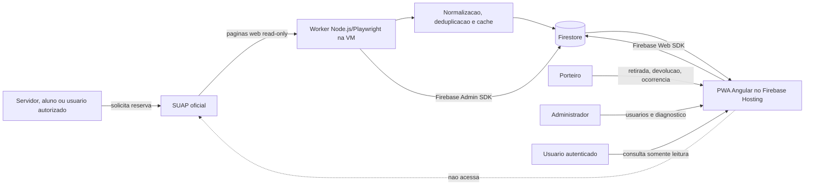

## Sincronizacao de reservas SUAP

```mermaid
sequenceDiagram
    participant S as SUAP
    participant W as Worker
    participant C as Cache
    participant F as Firestore
    participant A as Admin/PWA

    W->>S: Login institucional read-only
    W->>S: Consulta relatorio de reservas futuras PS
    S-->>W: Tabelas paginadas com reservas
    W->>W: Extrai Visualizar, requestExternalId e periodo
    W->>W: Normaliza para reservations e occupancies
    W->>W: Compara externalId e fingerprint
    W->>F: Upsert reservations e occupancies
    W->>F: Atualiza reservation_sync_events
    W->>F: Atualiza sync_status/current
    W->>C: Atualiza cache curto
    A->>F: Consulta status sincronizado
```

## Sincronizacao de salas e chaves

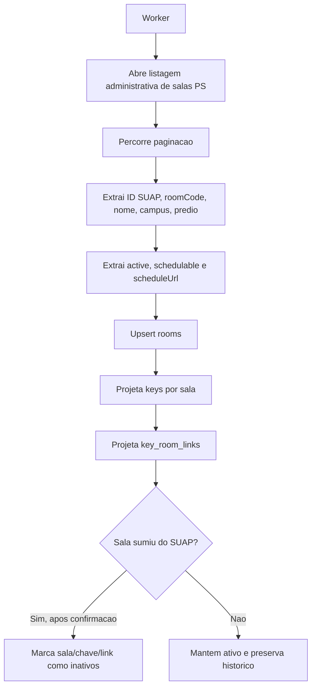

## Disponibilidade operacional

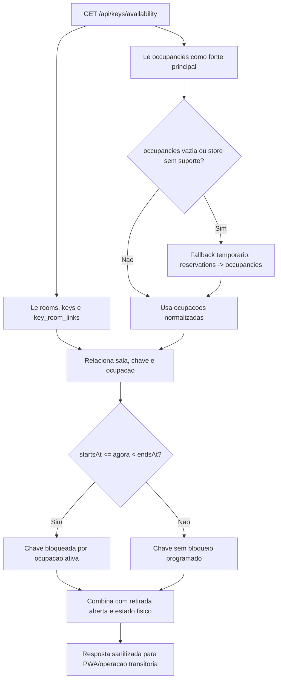

## Leitura operacional da PWA

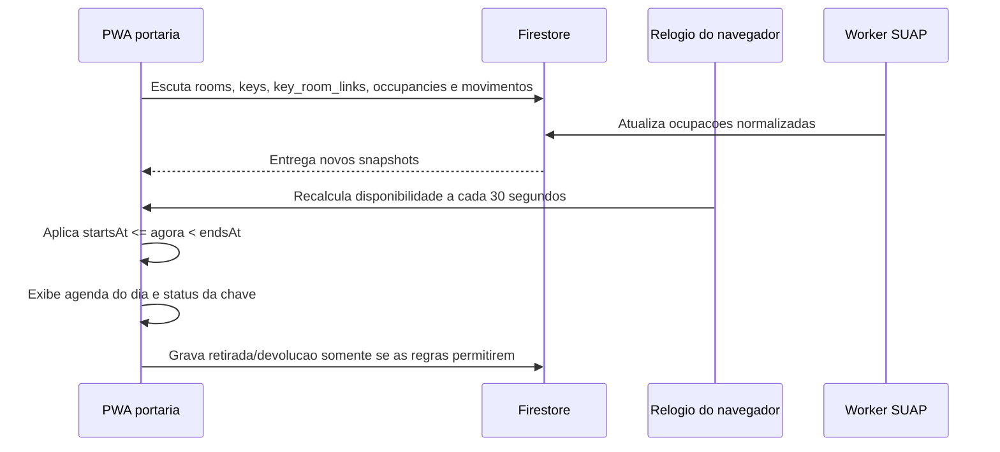

O intervalo de 30 segundos e apenas uma atualizacao do relogio da interface;
nao e uma janela de bloqueio antecipado. A chave fica bloqueada por ocupacao
somente durante o intervalo real. Uma retirada avulsa pode informar previsao de
retorno; se essa previsao ultrapassar o inicio da proxima ocupacao conhecida, a
PWA recusa a operacao.

## Atualizacao periodica

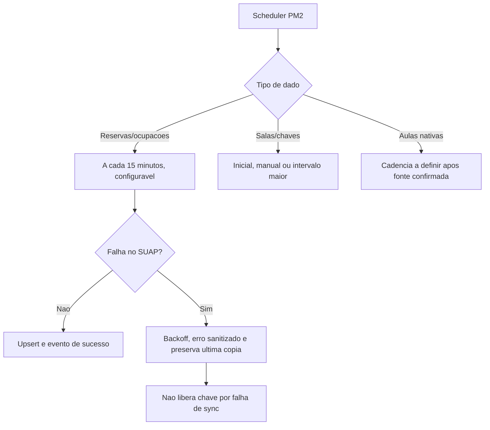

## Aulas nativas por agenda de sala

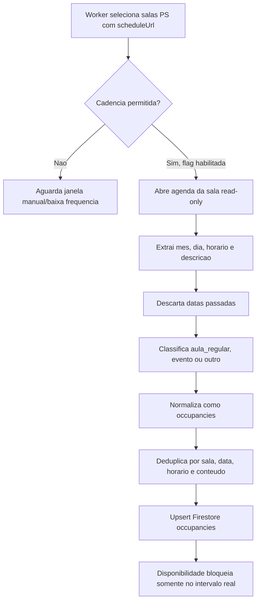

### Diagnostico controlado da agenda

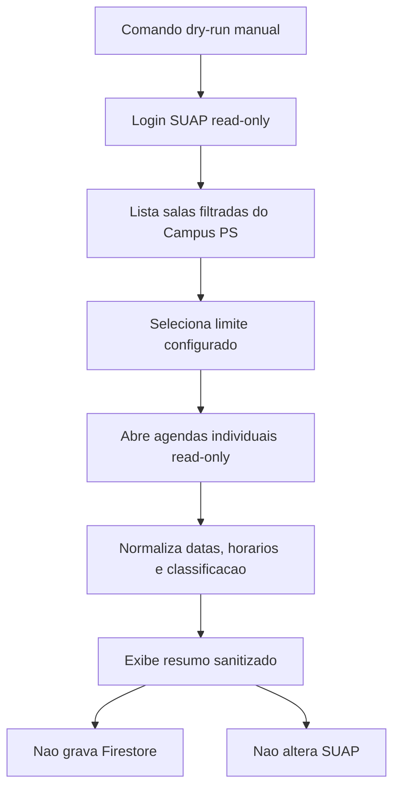

O dry-run existe para validar custo, cobertura e classificacao antes da
ativacao do scheduler. O worker continuo permanece com a flag desligada ate a
revisao desse resultado.

## Retirada e devolucao na portaria

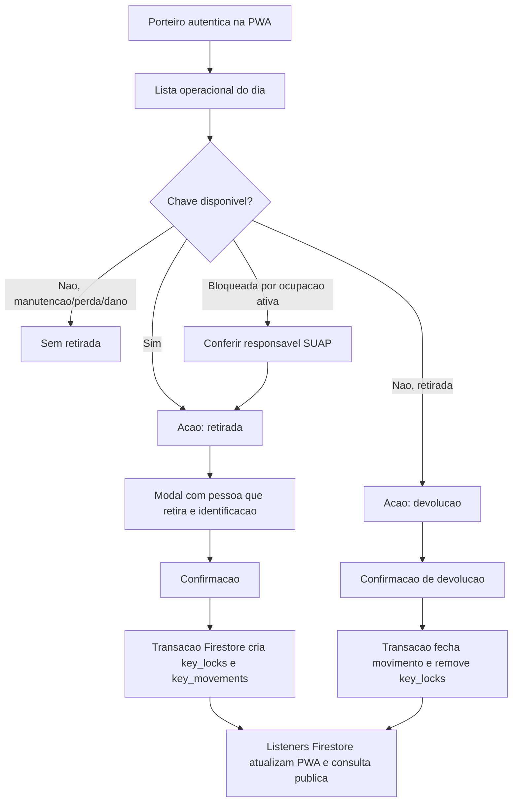

## Reserva SUAP e bloqueio da chave

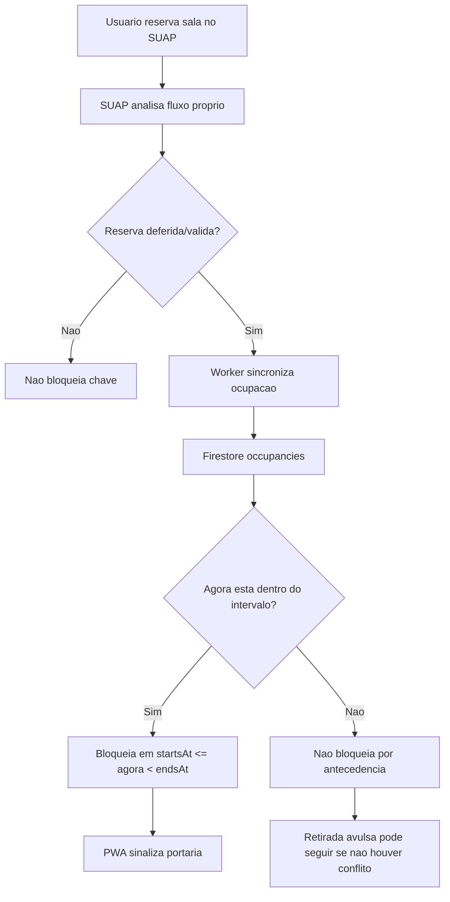

## Retirada avulsa sem reserva ativa

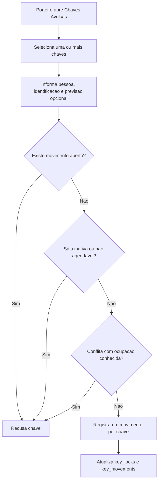

## Autenticacao e perfis

```mermaid
flowchart TD
    A[Usuario acessa PWA] --> B[Firebase Authentication Google]
    B --> C{Email verificado e permitido?}
    C -->|Nao| D[Acesso negado]
    C -->|Sim| E[Carrega users/{uid}]
    E --> F{Perfil}
    F -->|portaria| G[Operacao de chaves]
    F -->|admin| H[Administracao e diagnostico]
    F -->|usuario| I[Consulta publica somente leitura]
    G --> J[Security Rules validam escrita operacional]
    H --> J
    I --> K[Security Rules permitem leitura limitada]
```

## Modelo conceitual Firestore

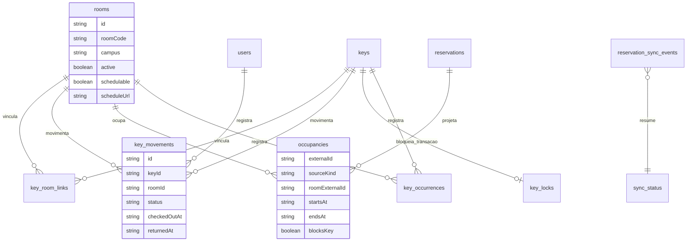

## Estados da chave

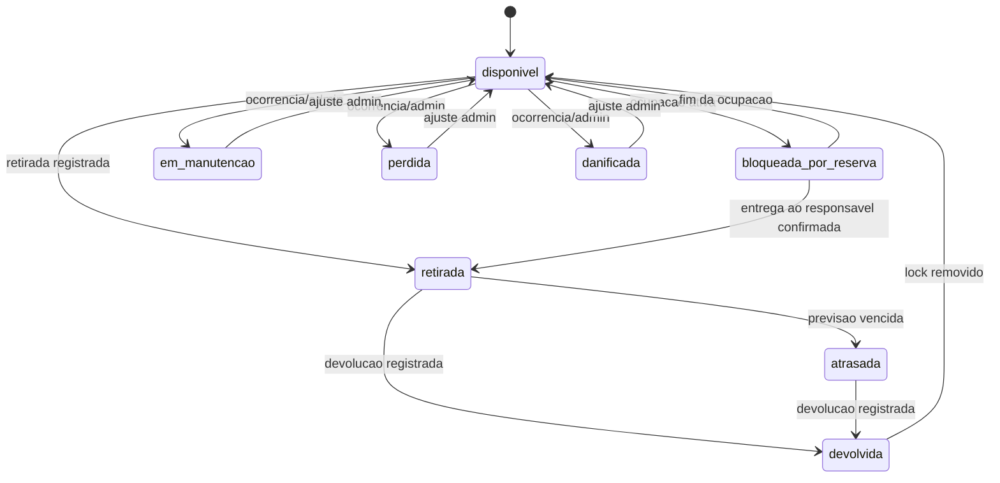

`devolvida` e estado historico de movimentacao. No estado operacional atual da
chave, a devolucao remove o lock e retorna a chave para `disponivel`, salvo se
houver manutencao, perda, dano ou ocupacao ativa no mesmo instante.

## Notificacoes e regras de negocio

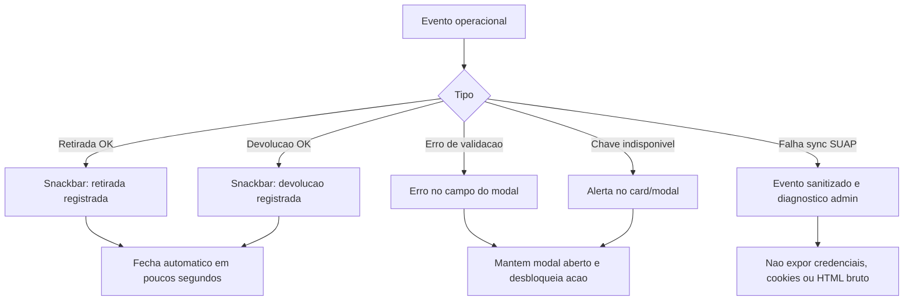

Regras principais:

- Toda retirada/devolucao precisa ser auditavel.
- Retirada avulsa pode envolver varias chaves, mas gera um movimento por chave.
- Falha de scraping nao apaga a ultima copia confiavel.
- Ausencia temporaria em uma sincronizacao nao significa cancelamento imediato.
- Dados pessoais devem ser exibidos conforme perfil e necessidade operacional.
