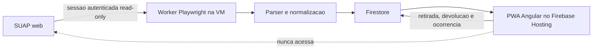
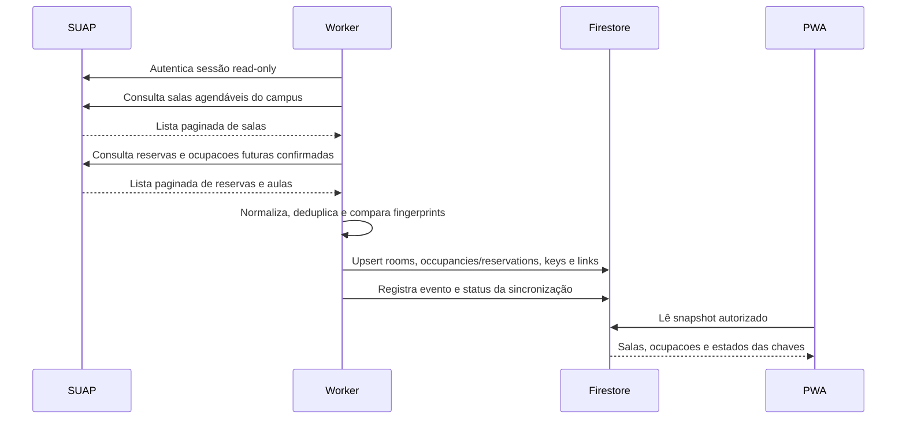
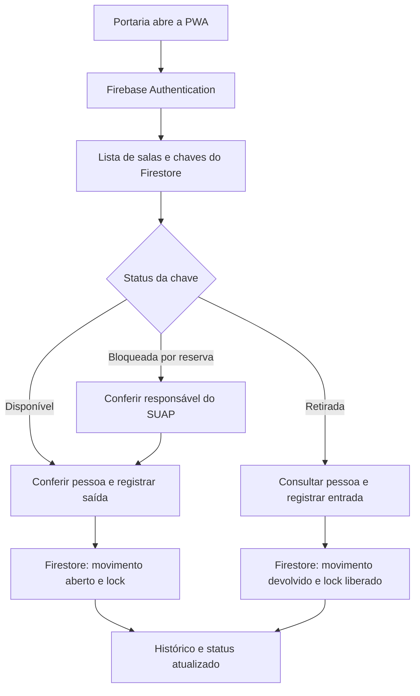
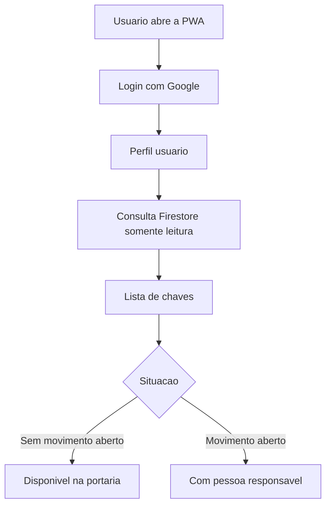

# Fluxos e modelo de dados

Este documento consolida a origem dos dados, as responsabilidades de cada
componente e o modelo de colecoes usado pelo sistema.

Os diagramas oficiais e atualizados continuamente ficam em
[diagramas.md](diagramas.md). Este documento mantem a descricao textual e os
exemplos de modelo.

Todo o modelo descrito neste documento se refere ao IFBA Campus Porto Seguro
(`PS`). Nos filtros SUAP atualmente mapeados, Porto Seguro corresponde a
`campus=27`.

## Fluxo geral



O SUAP continua sendo o sistema oficial de reservas. O sistema IFBA Campus
Porto Seguro apenas le dados autorizados desse campus, armazena uma copia
estruturada e controla a operacao fisica das chaves.

## Formas de ocupacao e retirada

O sistema trabalha com tres categorias operacionais:

1. Aulas nativas: aulas regulares do campus vindas da programacao academica do
   SUAP. Elas sao ocupacoes programadas e bloqueiam a chave somente durante o
   intervalo cronologico da aula.
2. Reservas SUAP: reservas nao regulares para aulas extras, projetos, reunioes,
   eventos, cursos, treinamentos, auditorio, ginasio, laboratorios e outros
   ambientes. Apenas reservas validas e confirmadas bloqueiam a chave.
3. Retiradas avulsas: movimentacoes feitas na portaria pela PWA, para uma ou
   mais chaves, quando nao existe conflito com aula ou reserva programada.

Aulas nativas e reservas SUAP sao fontes externas sincronizadas pelo backend.
Retirada avulsa nao vem do SUAP e nao cria reserva: ela registra somente a posse
fisica da chave no Firestore.

Bloqueio e liberacao dependem da cronologia da ocupacao. Uma ocupacao
confirmada bloqueia quando `startsAt <= agora < endsAt`. Antes do inicio, a
chave pode ser retirada de forma avulsa se estiver fisicamente disponivel e se a
previsao/uso informado nao conflitar com a ocupacao futura. Apos `endsAt`, o
bloqueio programado deixa de existir, mas a chave so volta a ficar disponivel
se nao houver retirada aberta, atraso, manutencao, perda ou dano.

## Fontes do SUAP

### Reservas futuras

```text
https://suap.ifba.edu.br/comum/sala/reservasala_relat/
```

O worker consulta somente a janela futura configurada, percorre a paginação e
coleta reservas deferidas do Campus Porto Seguro (`PS`, `campus=27`).

### Salas agendáveis

```text
https://suap.ifba.edu.br/admin/comum/sala/?agendavel__exact=1&all=&predio__uo=27
```

Essa listagem é a fonte para obter as salas do Campus Porto Seguro (`PS`) e
suas opcoes operacionais no SUAP, inclusive salas que ainda não possuem reserva
futura. O worker percorre a paginação na mesma sessão institucional read-only
usada para o relatório de reservas e atualiza o Firestore por `externalId`.

A sincronizacao de salas deve observar campos e opcoes como `Ativa`,
`Agendavel` e o link `Solicitar/Ver Reservas`. Esses valores podem ser alterados
posteriormente por um administrador do SUAP, portanto nao devem ser tratados
como constantes definitivas.

Nenhuma URL `solicitar_reserva/<id>` deve ser cadastrada individualmente. O ID
da sala deve ser extraído da listagem administrativa e usado como identificador
externo estável.

### Agenda atual da sala

```text
https://suap.ifba.edu.br/comum/sala/solicitar_reserva/{suapRoomId}/
```

Essa pagina exibe a agenda mensal da sala e pode conter aulas nativas,
reservas deferidas, indisponibilidades e conflitos. A primeira implementacao
entregue nesta frente e um normalizador isolado para transformar entradas
futuras da agenda em `occupancies`. A classificacao inicial e conservadora:
entradas com padrao claro de turma/aula/disciplina viram `aula_regular`;
projetos, atendimentos, reunioes, cursos, TCCs e eventos obvios viram `evento`;
entradas sem padrao confiavel ficam como `outro`.

Essa fonte deve ser usada com cautela: abrir a agenda individual de todas as
salas em intervalos curtos pode aumentar a carga sobre o SUAP. Por isso, a
execucao real deve respeitar cadencia propria, janela futura e limites
configurados. Datas anteriores ao inicio da janela nao devem ser importadas.

Implementacao atual: o Playwright pode visitar `scheduleUrl` das salas ativas e
agendaveis somente quando `SUAP_ROOM_SCHEDULE_SYNC_ENABLED=true`. A execucao e
limitada por `SUAP_ROOM_SCHEDULE_SYNC_MAX_ROOMS` e
`SUAP_ROOM_SCHEDULE_SYNC_WINDOW_DAYS`. O ambiente de exemplo permanece seguro
com a flag desligada, enquanto a configuracao versionada do PM2 a habilita para
34 salas do PS. O comando `npm run suap:schedule:dry-run` continua disponivel;
ele sobrescreve a flag apenas em memoria, limita a quantidade de salas e nao
grava Firestore. A selecao exige `campus=PS`, sala ativa, agendavel e com
`scheduleUrl`.

## Coleções Firestore

### `rooms/{suapRoomId}`

Fonte: listagem de salas agendáveis do SUAP.

```json
{
  "id": "1281",
  "externalId": "1281",
  "name": "A06 - SALA DE AULA - Bloco A",
  "campus": "PS",
  "building": "Bloco A",
  "floor": null,
  "schedulable": true,
  "scheduleUrl": "https://suap.ifba.edu.br/comum/sala/solicitar_reserva/1281/",
  "source": "suap-web",
  "sourceUrl": "https://suap.ifba.edu.br/admin/comum/sala/",
  "active": true,
  "firstSeenAt": "2026-07-28T18:00:00Z",
  "lastSeenAt": "2026-07-28T18:00:00Z",
  "updatedAt": "2026-07-28T18:00:00Z"
}
```

O documento é atualizado por `upsert`, usando o ID do SUAP. A PWA pode ler,
mas não pode criar, editar ou excluir documentos dessa coleção. Se o SUAP passar
a informar que a sala nao esta ativa ou nao e agendavel, o documento deve ser
atualizado para refletir a nova situacao e a PWA deve sinalizar a restricao sem
apagar historico de movimentacoes.

### `occupancies/{externalOccupancyId}`

Fonte: modelo normalizado alvo para aulas nativas e reservas SUAP confirmadas.

```json
{
  "externalId": "suap-request-44487-1304-2026-07-29T14:00",
  "source": "suap-web",
  "sourceKind": "reserva_deferida",
  "sourceUrl": "/comum/sala/ver_solicitacao/44487/",
  "requestExternalId": "44487",
  "roomExternalId": "1304",
  "roomCode": "C08",
  "roomName": "C08 - LABORATORIO DE INFORMATICA II - Bloco C",
  "campus": "PS",
  "startsAt": "2026-08-03T14:00:00-03:00",
  "endsAt": "2026-08-03T17:00:00-03:00",
  "responsibleName": "Responsavel da ocupacao",
  "responsibleIdentifier": "institucional",
  "status": "active",
  "blocksKey": true,
  "fingerprint": "sha256:...",
  "firstSeenAt": "2026-07-29T18:00:00Z",
  "lastSyncedAt": "2026-07-29T18:00:00Z"
}
```

`sourceKind` diferencia `aula_regular`, `reserva_deferida`,
`solicitacao_reserva`, `aula_extra`, `contraturno`, `evento`,
`auditorio_ginasio` e `outro`. O bloqueio operacional e calculado pela regra
cronologica `startsAt <= agora < endsAt`, combinada com status confirmado e
estado fisico da chave.

### `reservations/{externalReservationId}`

Fonte: relatório de reservas deferidas do SUAP.

```json
{
  "externalId": "reserva-123",
  "source": "suap-web",
  "roomName": "A06 - SALA DE AULA - Bloco A",
  "roomExternalId": "1281",
  "campus": "PS",
  "startsAt": "2026-08-03T14:00:00-03:00",
  "endsAt": "2026-08-03T17:00:00-03:00",
  "responsibleName": "Responsavel da reserva",
  "responsibleIdentifier": "institucional",
  "status": "active",
  "fingerprint": "sha256:...",
  "firstSeenAt": "2026-07-28T18:00:00Z",
  "lastSyncedAt": "2026-07-28T18:00:00Z"
}
```

Esta colecao representa a copia atual das reservas SUAP e pode continuar
existindo durante a transicao. A disponibilidade operacional ja usa
`occupancies` como fonte principal no backend, mantendo `reservations` como
fallback temporario e trilha de compatibilidade.

### `keys/{keyId}`

O SUAP informa a sala, mas pode não informar o código físico gravado na chave.
Enquanto não houver uma fonte institucional desse código, o backend cria uma
projeção técnica associada à sala, marcada como `provisional: true`.

```json
{
  "id": "key-1281",
  "roomId": "1281",
  "code": "CHAVE-1281",
  "label": "Chave da sala A06 - SALA DE AULA - Bloco A",
  "baseStatus": "disponivel",
  "source": "suap-room-projection",
  "provisional": true,
  "updatedAt": "2026-07-28T18:00:00Z"
}
```

Essa projeção não é um cadastro feito pelo usuário. Se posteriormente existir
uma identificação oficial das chaves, o backend deverá substituir a projeção
sem alterar o histórico das movimentações.

### `key_room_links/{keyId}__{roomId}`

```json
{
  "keyId": "key-1281",
  "roomId": "1281",
  "source": "suap-room-projection",
  "updatedAt": "2026-07-28T18:00:00Z"
}
```

### Coleções operacionais

```text
key_movements             retiradas e devoluções
key_locks                 bloqueio transacional de retirada
key_occurrences           ocorrências da portaria
users                     perfis Firebase autorizados
reservation_sync_events   auditoria das sincronizações
sync_status/current       estado atual do worker
```

Uma movimentação registra a pessoa que retirou, o operador da portaria, a sala,
a chave, horários, observações e, quando houver, a reserva relacionada. O
responsável da reserva e a pessoa que efetivamente retirou são campos distintos.
Quando a retirada avulsa envolve várias chaves, a PWA registra uma movimentação
por chave, reutilizando a mesma pessoa responsável, identificação, operador e
previsão opcional de retorno, dentro de uma única transação Firestore. A
operação é tudo-ou-nada: se uma chave não puder ser retirada, nenhuma chave do
lote é gravada.

A validacao deve ser aplicada para cada chave selecionada. Se uma delas estiver
emprestada, indisponivel ou bloqueada por aula/reserva confirmada, essa chave
nao deve entrar na operacao avulsa.

## Fluxo de sincronização



Falha temporária não deve apagar a última cópia confiável nem liberar uma chave
bloqueada. Ausências de reservas passam primeiro por `suspect_absent`; somente
após as confirmações configuradas passam a `absent`.

## Fluxo operacional da portaria



A aplicação não entrega fisicamente a chave e não substitui a conferência do
porteiro. Também não cria, altera ou cancela reservas no SUAP.

Uma aula nativa ou reserva SUAP confirmada bloqueia a retirada avulsa somente
durante o intervalo real da ocupacao. A retirada avulsa so pode ocorrer quando
a chave esta disponivel na portaria, nao possui movimento aberto e nao existe
ocupacao programada conflitante com o uso solicitado.

Quando uma movimentação vinculada a reserva é devolvida, a reserva pode
continuar aparecendo na lista do dia apenas como histórico, sem nova ação. A
chave fica livre para retirada avulsa após a remoção do lock, salvo se outra
ocupacao ativa estiver em andamento naquele horario.

## Fluxo de consulta pública



O perfil `usuario` não registra retirada, devolução ou ocorrência. A página
publica usa apenas `rooms`, `keys`, `key_room_links` e `key_movements` para
mostrar a situação atual das chaves.

## Regras de acesso

- `jacsonlinux@gmail.com`: perfil `portaria`, acesso somente à operação.
- `willian.barboza@ifba.edu.br`: perfil `portaria`, acesso somente à operação.
- `jacsoncorrea@ifba.edu.br`: perfil `admin`, usuários e diagnóstico da
  sincronização, sem cadastro de salas ou chaves na PWA.
- Demais contas Google autenticadas e verificadas: perfil `usuario`, somente
  consulta publica da situação das chaves.
- O worker usa Firebase Admin SDK para atualizar projeções.
- A PWA usa Firebase Web SDK e Security Rules.
- O frontend nunca recebe senha do SUAP, cookies de sessão, service account ou
  `client_secret`.
